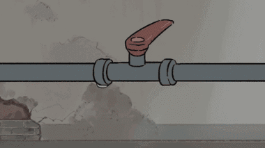

### <h3 align="center"> 🪷 Technologies and Tools 🪷 <h3/>

    
    
     
     
   <table>
  <tr>
    <td align="center" width="96">
        
       Javascript
    </td>
    <td align="center" width="96">
        
       Typescript
    </td>
    <td align="center" width="96">
        
       React
    </td>
    <td align="center" width="96">
      
       Redux
       <td align="center" width="96">
        
       Github
    </td>
        <td align="center" width="96">
        
       Rest API
    </td>
    <td align="center" width="96">
        
       Nginx
    </td>
        <td align="center" width="96">
        
       Docker
    </td>
    </td>
       <td align="center" width="96">
        
       Kubernetes
    </td>
  </tr>
  <tr>
    <td align="center"  width="96">
        
       HTML
    </td>
    <td align="center" width="96">
        
       CSS
    </td>
    <td align="center" width="96">
        
       Tailwind
    </td>
    <td align="center" width="96">
        
       Git
    </td>
    <td align="center" width="96">
        
       Mongodb
    </td>
    <td align="center" width="96">
        
       Redis
    </td>
    <td align="center" width="96">
        
       PostgreSQL
    </td>
    <td align="center"  width="96">
        
       Nodejs
    </td>
    <td align="center" width="96">
        
       Nestjs
    </td>
  </tr>
   <tr>
    </td>
        <td align="center" width="96">
        
       Postman
    </td>
    <td align="center" width="96">
        
       Vscode
    </td>
        <td align="center" width="96">
        
       Linux
    </td>
    <td align="center" width="96">
        
       RabbitMQ
     </td>
    <td align="center" width="96">
        
       Terraform
    </td>
    <td align="center" width="96">
        
       Tauri
    </td>
    <td align="center" width="96">
        
       Svelte
    </td>
    <td align="center" width="96">
        
       Firebase
    </td>
    <td align="center" width="96">
        
       Rollupjs
    </td>
  </tr>
 <tr>
 </tr>
</table>

### <h3 align="center"> 🍃 GitHub Stats 🍃 </h3>

  
   
   
  
  

### <h3 align="center"> 💡 A Quote 💡 </h3>

 
 

### <h3 align="center"> 🔫 Code Cycle 🔫 </h3>

 
 

&nbsp;&nbsp;&nbsp;&nbsp;&nbsp;

&nbsp;&nbsp;&nbsp;&nbsp;&nbsp;
 

 

    
    
    
    
    
    
    
    
    
    
    
    
    
    
    
    
    
    
    
    
    
    
    
    

